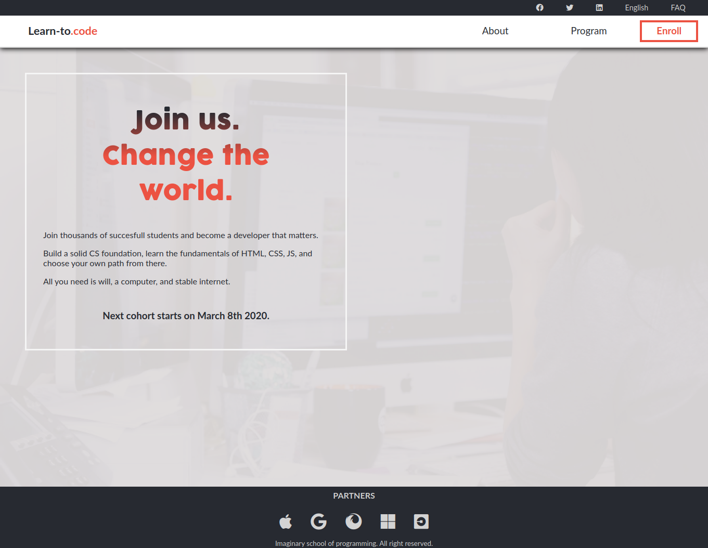

>Capstone HTML&CSS Project at Microverse

# Built With

HTML, CSS

# Live Demo

[Live Demo Link](https://gifted-morse-5d1101.netlify.com)

# Prerequisites

- Get your browsers up to date

# Setup

- Clone the repository on your local machine
- cd into the folder, find the index.html file and open it

# Install

- Install VSCode or any code editor you like
- Install Node JS and nmp(most recents versions)
## Stylelint (CSS linter) installation
- Run these commands on your terminal in order to install stylelint: 
npm install stylelint-config-recommended --save-dev

### Run tests

- Test the css by typing the command: npx stylelint .
- Go to http://validator.w3.org/ , upload the index.html file to test it.

### Deployment

- Get an online web hosting service
- Upload all the files in the htdocs folder of your domain
- Access your domain name in browser

## Authors

👤 **Author**
Stefan Dili

[@github](https://github.com/dili021)

[@twitter](https://twitter.com/dilistefan)

[@linkedin](https://linkedin.com/in/stefan-dili)

## 🤝 Contributing

Contributions, issues and feature requests are welcome!

## Show your support

Give a ⭐️ if you like this project!

## Acknowledgments

Credit to Cindy Shin for design inspiration

